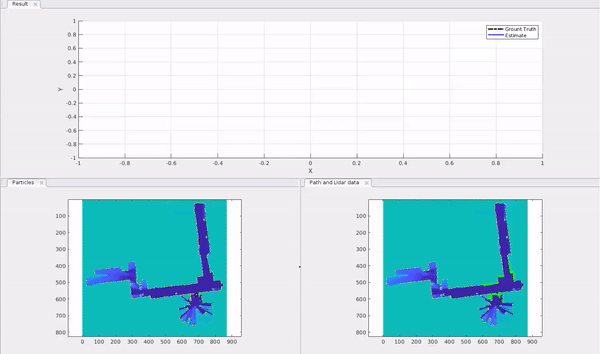

# Particle-Filter-Based-Localization
## Overview
Implementation of Particle filter for pose tracking in 2D space.

## System
## Problem Statement
[PDF link](week4.pdf)

## Results
### Demostration

### Estimate vs GT

  

